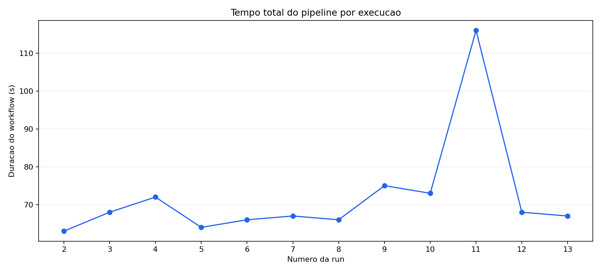
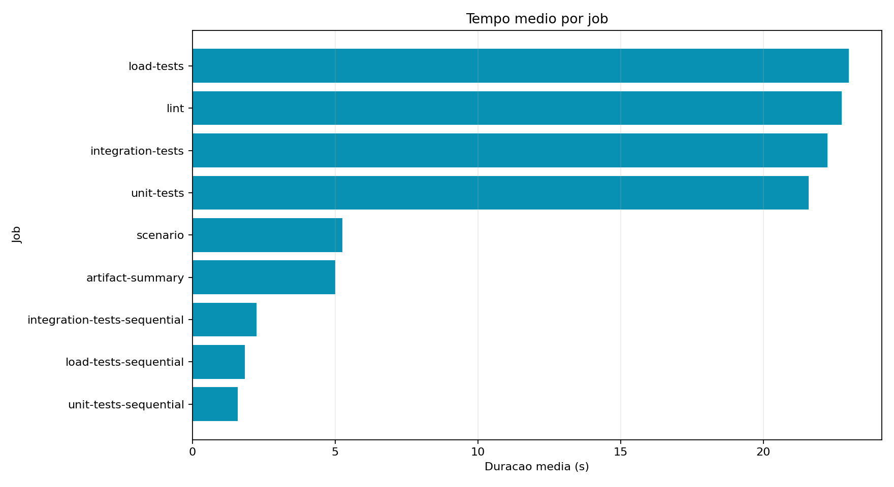
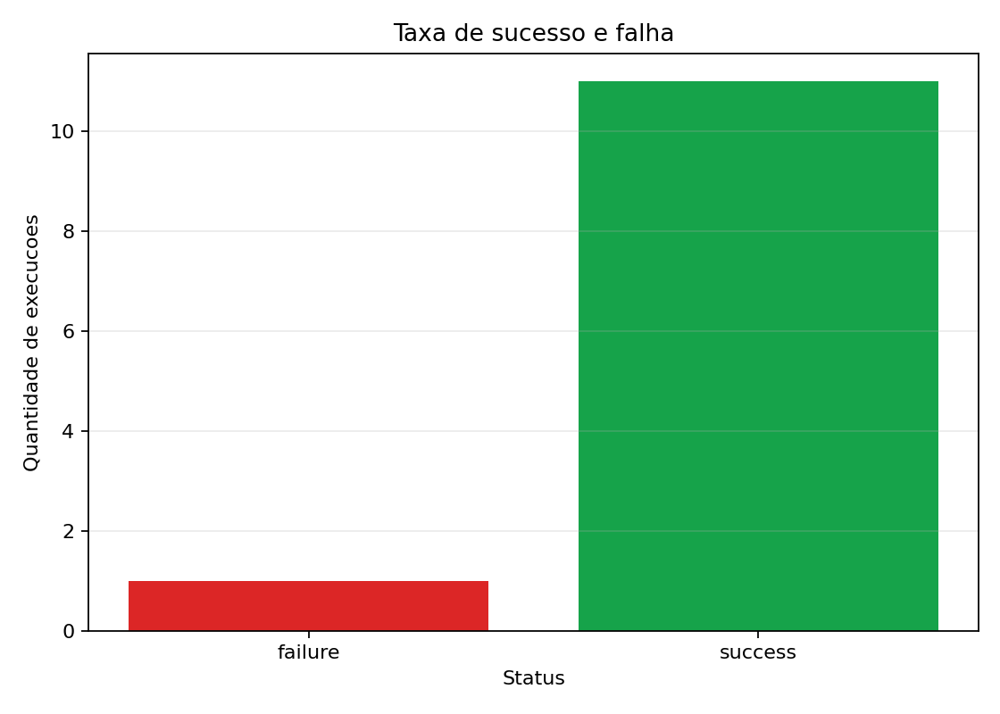
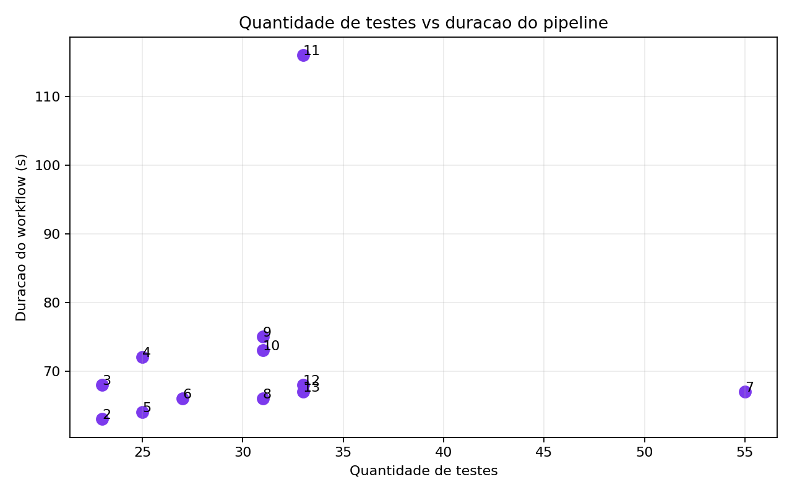

# Relatorio tecnico: EventOps Campus CI/CD

## 1. Contexto do projeto

O EventOps Campus e um sistema Python para organizar eventos academicos em salas
do campus. Ele usa as salas A01 a A13, Auditorio e Multiuso, detectando conflitos
de horario, capacidade, recursos ausentes e sobreposicao de agenda.

A pipeline foi criada no GitHub Actions para medir o comportamento real do CI/CD
com variacoes controladas. O experimento executou 12 runs reais em 8 de junho de
2026, cada uma disparada por um commit especifico na branch `main`.

Repositorio: <https://github.com/Anacajp/ponderada-pipe>

Workflow YAML:
<https://github.com/Anacajp/ponderada-pipe/blob/main/.github/workflows/eventops-ci.yml>

## 2. Hipotese inicial

Antes das execucoes, as hipoteses eram:

- o job de testes de carga seria o principal gargalo;
- a segunda execucao baseline seria mais rapida por causa de cache aquecido;
- o modo paralelo reduziria o tempo total quando comparado ao modo sequencial;
- a falha controlada apareceria em testes e deixaria uma run vermelha para analise.

## 3. Execucoes reais

| Cenario | Run ID | Commit | Status | Duracao | Testes | Falhas | Link da execucao | Variacao |
| --- | --- | --- | --- | ---: | ---: | ---: | --- | --- |
| 01 | 27116773594 | 0638d82 | success | 63s | 23 | 0 | [run](https://github.com/Anacajp/ponderada-pipe/actions/runs/27116773594) | Baseline paralelo |
| 02 | 27116775479 | b477a65 | success | 68s | 23 | 0 | [run](https://github.com/Anacajp/ponderada-pipe/actions/runs/27116775479) | Cache aquecido |
| 03 | 27116777697 | 0e0583f | success | 72s | 25 | 0 | [run](https://github.com/Anacajp/ponderada-pipe/actions/runs/27116777697) | Conflito de capacidade |
| 04 | 27116780251 | c3784a7 | success | 64s | 25 | 0 | [run](https://github.com/Anacajp/ponderada-pipe/actions/runs/27116780251) | Recurso ausente |
| 05 | 27116782047 | 8aa7487 | success | 66s | 27 | 0 | [run](https://github.com/Anacajp/ponderada-pipe/actions/runs/27116782047) | Sobreposicao de horario |
| 06 | 27116783908 | b363f8b | success | 67s | 55 | 0 | [run](https://github.com/Anacajp/ponderada-pipe/actions/runs/27116783908) | Mais testes sinteticos |
| 07 | 27116785547 | b7f2af8 | success | 66s | 31 | 0 | [run](https://github.com/Anacajp/ponderada-pipe/actions/runs/27116785547) | Agenda media |
| 08 | 27116787898 | ee501de | success | 75s | 31 | 0 | [run](https://github.com/Anacajp/ponderada-pipe/actions/runs/27116787898) | Teste lento |
| 09 | 27116789550 | 37e0db4 | success | 73s | 31 | 0 | [run](https://github.com/Anacajp/ponderada-pipe/actions/runs/27116789550) | Cache invalidado |
| 10 | 27116791289 | 3f94043 | success | 116s | 33 | 0 | [run](https://github.com/Anacajp/ponderada-pipe/actions/runs/27116791289) | Jobs sequenciais |
| 11 | 27116792822 | 7a21193 | failure | 68s | 33 | 1 | [run](https://github.com/Anacajp/ponderada-pipe/actions/runs/27116792822) | Falha controlada |
| 12 | 27116794737 | d06f56f | success | 67s | 33 | 0 | [run](https://github.com/Anacajp/ponderada-pipe/actions/runs/27116794737) | Recuperacao verde |

Base de dados gerada:
[`entregaveis/dados/pipeline_metrics.csv`](dados/pipeline_metrics.csv)

JSON auxiliar com links das runs:
[`entregaveis/dados/workflow_runs.json`](dados/workflow_runs.json)

## 4. Graficos

## 5. Analise das perguntas obrigatorias

### Qual etapa mais contribuiu para o tempo total do pipeline?

Considerando apenas jobs realmente executados, os maiores tempos medios ficaram
nos jobs de teste e instalacao. O maior valor medio foi `integration-tests-sequential`
com 30s, mas ele apareceu apenas no cenario sequencial. Entre os jobs recorrentes,
`load-tests` ficou com media de aproximadamente 25,09s, seguido por
`integration-tests` com 24,27s e `unit-tests` com 23,55s.

Na pratica, o gargalo nao foi apenas o tempo de execucao dos testes, mas a
repeticao do ciclo "setup Python + instalar dependencias" em varios jobs.

### Houve diferenca significativa entre execucoes com e sem cache?

A diferenca nao foi tao clara quanto a hipotese previa. O cenario 01 levou 63s,
o cenario 02, que deveria se beneficiar de cache aquecido, levou 68s, e o cenario
09, com invalidacao controlada de cache, levou 73s.

Isso sugere que o cache ajudou menos do que o esperado neste experimento. Como os
runners do GitHub sao hospedados e variam entre execucoes, parte do tempo tambem
pode ter sido influenciada por fila, provisionamento do runner e download de
dependencias.

### O paralelismo reduziu o tempo total? Em que condicoes?

Sim. A comparacao mais direta e entre os cenarios 10 e 12, ambos com carga alta.
O cenario 10 executou em modo sequencial e levou 116s. O cenario 12 voltou ao modo
paralelo com carga comparavel e levou 67s.

Isso indica uma reducao aproximada de 49s, ou cerca de 42%. O paralelismo ajudou
principalmente porque `unit-tests`, `integration-tests` e `load-tests` puderam
rodar ao mesmo tempo depois do lint.

### Quais falhas foram mais frequentes?

Houve apenas uma falha real no conjunto das 12 execucoes: o cenario 11. Essa falha
foi proposital, criada por `force_failure=true` no arquivo de experimento, para
demonstrar uma pipeline vermelha e validar a coleta de status e falhas.

Resultado geral:

- 11 execucoes com sucesso;
- 1 execucao com falha;
- 1 teste com falha no cenario 11.

### O pipeline fornece feedback rapido o suficiente?

Para os cenarios paralelos, o tempo total ficou geralmente entre 63s e 75s. Esse
tempo e aceitavel para feedback de desenvolvimento, pois retorna em cerca de um
minuto. O ponto de atencao e o modo sequencial, que chegou a 116s e piora a
experiencia de feedback.

Para uso real, manter jobs paralelos e separar testes lentos em uma etapa menos
frequente seria uma melhoria importante.

### Que melhorias poderiam ser feitas?

Melhorias recomendadas:

- reduzir instalacoes repetidas entre jobs, usando uma estrategia de cache mais
  agressiva ou empacotamento de dependencias;
- separar testes lentos para execucoes agendadas ou condicionais;
- publicar um resumo de testes diretamente no pull request;
- medir tambem tempo de fila do GitHub Actions;
- acompanhar tendencias em mais de 12 execucoes para reduzir ruido dos runners.

### Quais limitacoes existem nos dados coletados?

As principais limitacoes foram:

- apenas 12 execucoes, uma amostra pequena;
- runners hospedados pelo GitHub podem variar em desempenho;
- as execucoes foram disparadas em sequencia, o que pode introduzir efeitos de fila;
- os artefatos do GitHub Actions expiram depois de um tempo;
- o experimento mede um projeto pequeno, entao instalacao e setup pesam mais que
  a logica da aplicacao.

### Como essa analise apoia decisoes de engenharia?

A analise mostra onde vale otimizar primeiro. Neste caso, o ganho mais claro veio
do paralelismo, nao do aumento isolado de cache. Ela tambem mostra que falhas
controladas sao capturadas corretamente e que a pipeline oferece feedback rapido
quando os jobs rodam em paralelo.

Esses dados apoiam decisoes como manter jobs paralelos, revisar instalacao de
dependencias, tratar testes lentos separadamente e usar metricas historicas para
decidir se uma mudanca na pipeline realmente melhorou o tempo total.

## 6. Resultados inesperados

1. O cache aquecido nao deixou a segunda execucao baseline mais rapida. O cenario
   01 levou 63s e o cenario 02 levou 68s. A hipotese era que o segundo seria mais
   rapido, mas o resultado indica que variacao do runner e overhead de setup
   tiveram impacto relevante.
2. Aumentar a quantidade de testes sinteticos nao aumentou proporcionalmente o
   tempo total. O cenario 06 executou 55 testes e levou 67s, muito proximo dos
   cenarios com menos testes. Isso indica que, para este projeto, o custo fixo da
   pipeline pesa mais do que o custo incremental de cada teste.

## 7. Comparacao entre hipotese e resultado observado

A hipotese sobre paralelismo foi confirmada: o modo sequencial levou 116s, contra
67s no modo paralelo com carga alta. A hipotese sobre falha controlada tambem foi
confirmada: o cenario 11 ficou vermelho e registrou 1 falha.

A hipotese sobre cache foi parcialmente rejeitada. O cache invalidado foi mais
lento que o baseline, mas o cache aquecido nao trouxe melhora visivel entre os
cenarios 01 e 02. Ja a hipotese de que testes de carga seriam o gargalo foi apenas
parcialmente confirmada: `load-tests` foi um dos jobs mais caros, mas a instalacao
de dependencias repetida em varios jobs tambem teve peso importante.

## 8. Conclusao

O experimento mostrou que a pipeline do EventOps Campus e estavel e fornece
feedback rapido quando usa jobs paralelos. Em 12 execucoes reais, 11 terminaram
com sucesso e 1 falhou de forma controlada para validar a instrumentacao.

O principal gargalo observado foi a combinacao de setup, instalacao de
dependencias e jobs de teste. A maior melhoria pratica seria preservar o
paralelismo e reduzir trabalho repetido entre jobs. Para uma equipe real, essas
metricas ajudariam a manter o CI rapido, confiavel e orientado por evidencias.
